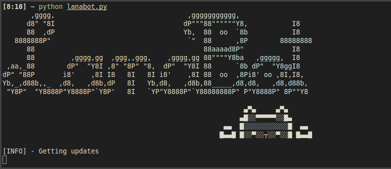
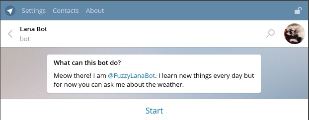
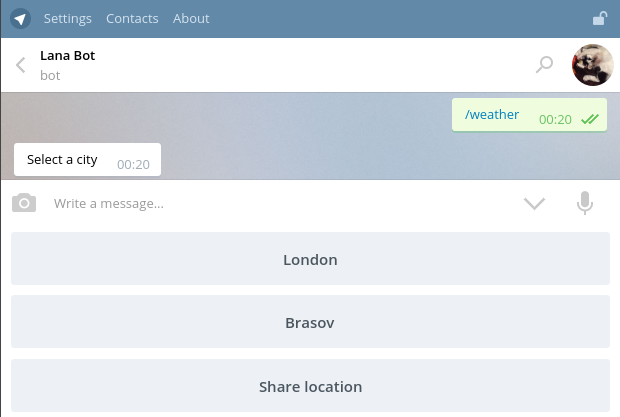
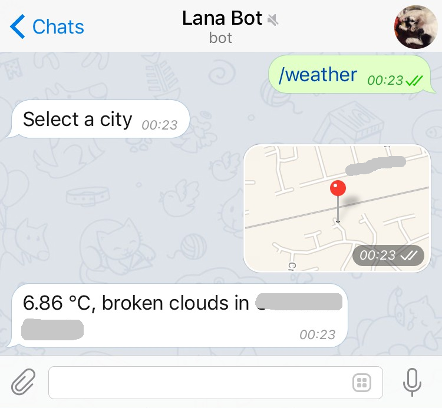

# LanaBot

This started as a learning project as my friend wanted to learn Python and to know how APIs work in practice. I've used the Telegram API to get a basic bot up and running. Currently it is just a basic weather bot :partly_sunny: but feel free to take it and expand it as you wish! 

Planned features:

 * Deployment on Raspberry PI
 * Take pictures with Picamera
 * Other cool AI :) features
 
 
The configuration file needs to be defined. Example of ```config.ini``` file:

```ini
[Settings]
; Telegram API token, from @Botfather
TOKEN = 111111:AAAAaaaaaaaaaaaaa

; Long polling interval, in seconds. How long to keep connection open
POLLING_TIMEOUT = 100

; Open Weather Map API Key
OWM_KEY = a3b2d786c264b21e6f3708c2bf4bc60

```

Props to Gareth Dwyer :thumbsup: and his [Chatbot tutorial](https://www.codementor.io/garethdwyer/building-a-telegram-bot-using-python-part-1-goi5fncay), from which
the inspiration to this, and some very handy implementation hints, came.

### Screenshots

Back-end:



Start interacting with the bot:



Chose location for weather status:



Weather for current location:




### Made with :heart: and:

 * [Python](https://www.python.org/)
 * [Telegram Bot API](https://core.telegram.org/bots/api)
 * [Markdown Editor](https://jbt.github.io/markdown-editor) 
 * [SQLite](https://docs.python.org/2/library/sqlite3.html) Lightwight disk-based database
 * [ASCII Art](http://www.kammerl.de/ascii/AsciiSignature.php) ASCII Text Signature Generator
 * [GitHub Markdown Emoji](https://gist.github.com/rxaviers/7360908) 

